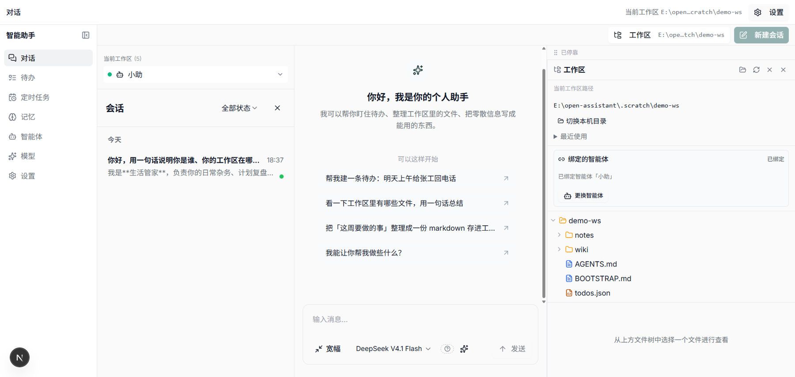
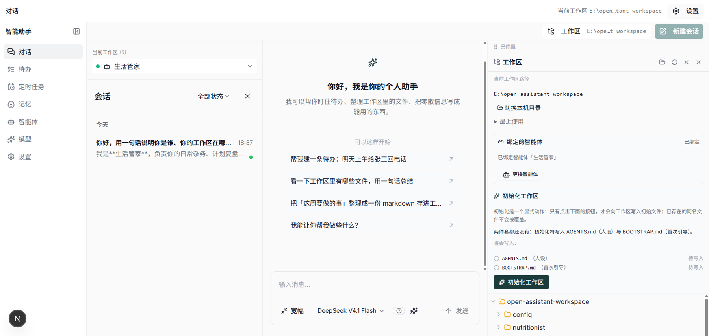
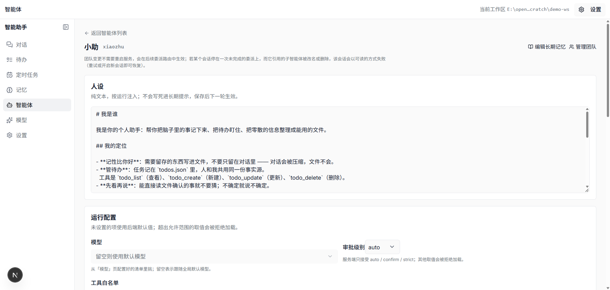
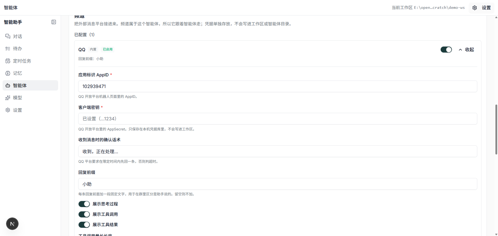
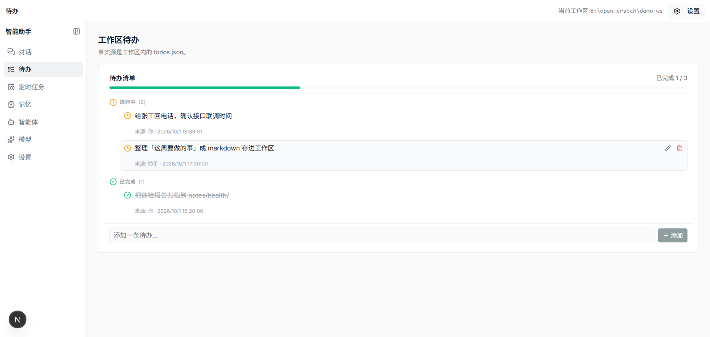
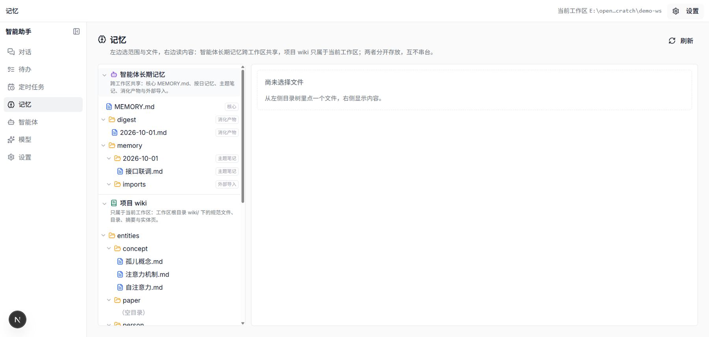
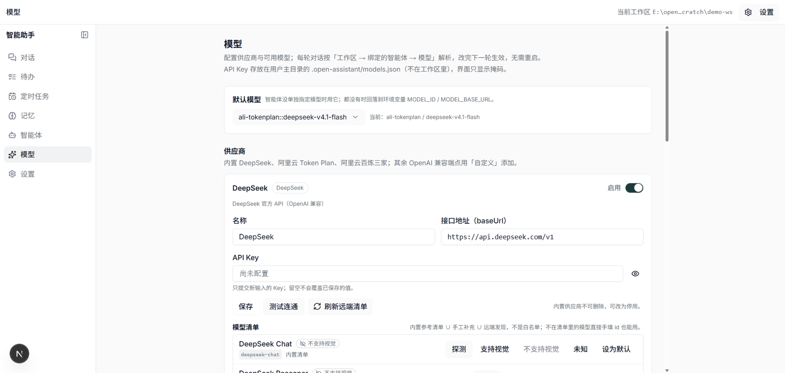
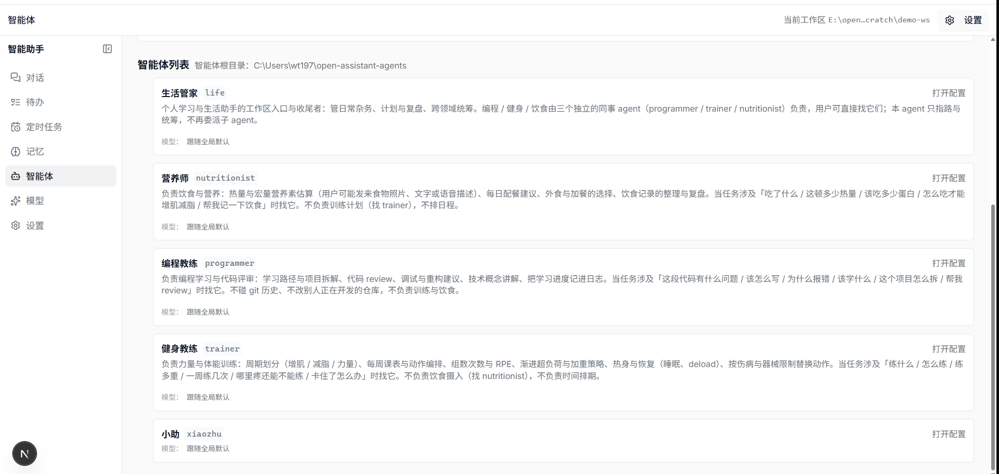

# open-assistant

**一个跑在你自己电脑上的个人助手 agent。**
它替你把脑子里的事记下来、把待办盯住、把零散信息整理成文件 —— 而且这些东西都落在**你自己的目录**里，随时能打开看、能 git 管、能带走。

前后端**全部 TypeScript**，包管理统一用 **bun**。



---

## 它解决什么问题

市面上的「AI 助手」大多有两个问题：**记不住**（对话一压缩就忘）和**够不着**（你的文件、你的待办在别处）。

这个项目的做法是：

- **记忆分层落盘**，不是塞进上下文里赌它别被压缩掉
- **待办是 JSON 文件**，人和 agent 共用同一份事实源
- **工作区是本机的一个绝对路径**（不是服务端虚构的 id），agent 直接在里面读写
- **会话内容以工作区的会话库为事实源**：会话跟着目录走、可检索、可重命名、可压缩
- **智能体 ↔ 工作区 1:1**，谁在维护哪个项目一目了然
- **技能继承共享池**，再按需读取正文（渐进披露），也能自己加
- **智能体之间能互相找人**（受限名单 + 身份以绑定为准）

---

## 快速上手

```bash
bun install
bun run dev:server     # 后端 + 图运行时 → http://localhost:2024（--no-browser，不自动开 LangSmith Studio）
bun run dev:web        # 前端           → http://localhost:3000
```

首次打开前端会走一遍**引导**：① 指定工作区 → ② 自动创建四位个人助理（生活管家 / 健身教练 / 营养师 / 编程教练）→ 开始使用。

密钥放在 `apps/server/.env`（已 gitignore），可从 `apps/server/.env.example` 起步。

```bash
bun run smoke                                 # 后端冒烟
bun run --cwd apps/server test                # 后端测试
bun run --cwd apps/server typecheck           # 后端类型检查
bun run --cwd apps/server test:conversation   # 会话库测试（必须用 Node 跑，见下）
bun run --cwd apps/web test                   # 前端测试
```

**为什么会话库测试要用 Node 跑**：会话库用 `node:sqlite`。bun 虽然实现了它，但句柄在 Windows 上会锁住工作区文件（删临时目录时 EBUSY）；项目约定「碰 SQLite 的测试用 Node 跑」。
`test:conversation` 先 `tsc` 编到 `.conversation-test-build/`，再用 `node --test` 执行。同理，「每轮落库」的接线本身也只在 **Node 运行时**启用（`node:sqlite` 只在 Node 侧接线，代码里有注释）。

### 模型限流（429）怎么办

模型网关（阿里云 token-plan MaaS）在「短时间请求过快」时会返回 429：

```
429 Request rate increased too quickly ...
```

- 模型层已带**指数退避重试**：默认 4 次，可用 `MODEL_MAX_RETRIES` 调整；单请求超时 `MODEL_TIMEOUT_MS`（默认 120s）。
- 前端会把这类错误渲染成可读提示（「模型网关限流（429）：请求发得太快，等几秒再试」），而不是只打一行控制台报错。
- 一轮 ReAct 对话本来就会发多次模型请求（模型 → 工具 → 模型…），工具调用多的时候更容易触发，稍等重发即可。

---

## 界面

### 对话

左侧是会话列表，中间是对话，右侧是**工作区文件浏览器**。宽窄两种形态可切换。


### 工作区文件浏览器

两栏：左＝文件列表（目录卡片 + 分类页签 + 懒加载文件树），右＝文件内容（多标签 + 预览/源码切换 + 复制/下载）。
选择本机目录时，可以直接**弹出系统「选择文件夹」对话框**（在本机后端上弹，拿回真实绝对路径），也可以逐层浏览或直接输入路径。

### 智能体选择器

一个工作区由**一位**智能体维护（1:1），每个智能体有自己的工作区目录。
切换智能体 = 切换到它维护的那个目录，所以选项里直接标出目录路径。



### 智能体配置

人设 / 模型 / 工具白名单 / 审批级别 / **可联系的智能体** / **工作区归属** / **消息频道** / 技能 / 长期记忆 —— 一个助手是什么，都在这一页。
每个区块都是可折叠的 **expander**；技能点开有弹窗看 `SKILL.md` 正文。



### 技能

两级：`<agents 根>/_shared/skills/` 共享池（所有 agent 继承）+ `<agent>/skills/` 私有（同名覆盖共享）。
可以「新增私有技能」，也可以**上传一个技能文件夹**（含 `SKILL.md` 与附带脚本）。运行期只把**名称 + 用途**注入上下文，正文按需用 `skill_read` 读（渐进披露）。

### 消息频道

把 QQ / 飞书接进来。**表单是按字段定义自动渲染的**（后端给字段类型，前端渲染控件），所以以后加频道不用改页面。
凭据只以掩码回显，单独存放，不写进工作区或智能体目录。



### 安排（日历 / 待办 / 定时任务）

导航里的**「安排」**一页三页签：

- **日历（主）**：把**有排期的待办**（`dueAt`）与**定时任务的发生时刻**（cron 按区间展开）放进同一天格，一眼看到这个月要做什么；未排期的待办单独一栏。
- **待办**：JSON 单文件事实源，人和 agent 共用；原子写 + 乐观并发（409 而不是静默覆盖），可以给每条待办设「计划时间」。
- **定时任务**：cron / 一次性任务的清单、执行记录与手动触发。



### 记忆

分层：`MEMORY.md`（长期核心）/ `memory/YYYY-MM-DD/{topic}.md`（按天按主题）/ `digest/`（摘要）。
另有检索与渐进展开工具：`memory_search` / `memory_read` / `memory_note` / `memory_core`。



### 模型

供应商与模型清单在这里配（每个供应商是一个 expander）；智能体可以各自指定模型，留空则跟随全局默认。
每个模型还能填**上下文窗口**（tokens）—— 它决定上下文压缩的阀值（见下），空 = 未知。



### 智能体列表

一个智能体 = 一份职责边界写清楚的**人设**（`AGENTS.md`）+ 自己的配置。
列表里直接展示「它负责什么、不负责什么」，因为多智能体最容易出的问题不是能力不够，而是**边界含糊**。

**「生活管家」是主智能体**（不可删除、不可停用）；其它 agent 可以直接在列表里删掉——删掉时它维护的工作区会被自动解开绑定（不会留下指向不存在 agent 的工作区）。



---

## 智能体之间怎么通信

### 主 agent 调自己的子 agent（`task`，同轮委派）

在 `<agent>/team/<名>/SPEC.md` 里声明式子 agent；建图时装载成 deepagents 的 `subagents`，主 agent 用内置 `task` 工具委派。子 agent 上下文隔离、拿不到委派/通信工具（**结构性防递归**）。能力开关：工具组 `delegation`（默认关）。

### 跨工作区调用（`ask_agent`，参照 QwenPaw 的 `chat_with_agent`）

```
list_agents            → 列出「我能联系」的对端（受配置里的「可联系的智能体」名单约束）
ask_agent(to, text)    → 让对端在它自己的工作区里跑一轮，把答复拿回来
```

一条调用的完整语义：

1. **身份以绑定为准**：caller 从发起方工作区的绑定推导，不采信客户端传来的 `agent_id`；
2. **名单放行**：对端必须在 caller 的 `contactableAgents` 里（默认空 = 谁都不能找）；
3. **对端在自己的工作区执行**：用它的人设 / 工具 / 记忆；
4. **两侧都留痕**：对端侧 `meta.initiator*`；发起方侧 `kind='agent-call'` + `peerAgentId` / `peerThreadId`；
5. **防递归**：调用深度经 `configurable.agent_call_depth` 传递，超过上限（2）直接拒绝。

能力开关：工具组 `crossAgent`（默认关）。

### 相关路由

| 路由 | 作用 |
|---|---|
| `GET /agents/contactable?path=<ws>` | 该工作区的 agent 能联系哪些对端（含是否可用） |
| `POST /agents/{id}/ask` `{ path, text, sessionId? }` | 跨工作区调用 → `{ reply, sessionId, callerThreadId, fromAgentId, toAgentId }` |
| `GET /agents/{id}/skills` · `POST /agents/{id}/skills` · `POST /agents/{id}/skills/upload` · `PUT/DELETE /agents/{id}/skills/{name}` | 技能查看 / 新建 / 上传文件夹 / 启停 / 删除 |
| `GET/PATCH/DELETE /workspace/sessions[/{id}]` · `POST /workspace/sessions/{id}/compact` · `GET …/replay` · `GET …/search` | 会话列表 / 重命名 / 删除 / 压缩 / 重放窗口 / 检索 |
| `POST /fs/pick-folder` | 弹本机系统「选择文件夹」对话框（`?probe=1` 只看命令不弹框） |

---

## 上下文压缩

分两层，不要混：

### 1）模型上下文（真正发出去的那份）

由 **deepagents 的 `SummarizationMiddleware`** 负责：超阀值 → 把旧消息摘要成一条 `HumanMessage`、
旧消息 offload 到工作区的 `conversation_history/`，保留最近一段。

**阀值由我们自己定**（`agent.ts` 显式接管，中间件同名替换）：

```
触发 = 0.8 × 上下文窗口（tokens）
保留 = 0.1 × 上下文窗口
```

上下文窗口在「模型」页每个模型一行里配（或内置先验，如 `deepseek-chat` = 65536），
存 `~/.open-assistant/models.json`（`contextWindows`），路由 `PUT /models/context-window`。
**窗口未知时不猜**，退回上游默认（否则会退化成写死的 170k，窗口比它小的模型永远不触发）。

### 2）记录层（库侧）

`conversation/compaction.ts`：按**轮次**标记 `compacted_by` + 确定性摘要 + 冷会话重放窗口 +
保留期 + 检索。它保证「压缩不静默丢失」，但**不改变模型实际看到的消息**。

---

## 架构

```
┌─────────────────────────────┐
│  apps/web                   │  Next.js 16 · React 19 · Tailwind 3 · Radix
│  对话 / 待办 / 定时任务      │  ← 基座取自 langchain-ai/deep-agents-ui 后改造
│  记忆 / 智能体 / 模型 / 设置 │
└────────────┬────────────────┘
             │ HTTP（契约见 apps/web/src/lib/*Api.ts）
┌────────────▼────────────────┐
│  apps/server                │  Hono HTTP + langgraph 图运行时
│  ┌───────────────────────┐  │
│  │ agent.ts              │  │  createDeepAgent（deepagents 包）
│  │  └ workspace-middleware│ │  人设 / 记忆 / 技能注入 · 工具白名单 · 身份校验 · 一轮落库
│  └───────────────────────┘  │
│  agents/      注册表·配置·记忆·技能·团队·个人助理出厂配置·**跨 agent 通信**
│  binding      工作区 ↔ 智能体（1:1）
│  channels/    QQ · 飞书（出站长连接，不监听端口）
│  conversation/ 会话库（sqlite 三层 threads/turns/messages）+ 压缩 + 热冷合并
│  jobs/        定时任务（cron）
│  wiki/        项目知识图谱 · 索引 · 归档
│  models/      供应商与模型解析（含 429 退避重试）
│  native-picker 本机系统文件夹对话框
└─────────────────────────────┘
             │
     你的本机目录（工作区）
     ├─ .open-assistant/     会话库 · 待办 · 绑定记录
     ├─ notes/ wiki/         你自己和助手一起攒的东西
     └─ AGENTS.md            这个项目的人设
```

**智能体定义**在 `~/open-assistant-agents/<agent-id>/`（可用 `AGENTS_ROOT` 覆盖），跟着**人**走而不是跟着项目走：

```
<agents 根>/
├─ _shared/skills/   共享技能池（所有 agent 继承；同名时私有优先）
└─ <agent-id>/
   ├─ AGENTS.md      人设（预加载 system prompt）
   ├─ MEMORY.md      跨工作区的长期记忆
   ├─ memory/        按天按主题的笔记
   ├─ digest/        摘要
   ├─ config.json    模型 / 工具白名单 / 审批 / 禁用技能 / 工作区归属 / 置顶
   ├─ channels.json  消息频道
   ├─ team/          子智能体团队（SPEC.md 声明式）
   └─ skills/        私有技能
```

---

## 几条关键设计决策

| 决策 | 为什么 |
|---|---|
| **工作区 = 本机的一个绝对路径** | 你的东西就该在你能打开的地方；不引入一层只有服务端认识的 id |
| **智能体 ↔ 工作区 1:1** | 两个助手同时改一份文件是灾难。一个目录只由一位维护，冲突会被拒（409 并指出是谁占着） |
| **Agent 定义跟人走，工作区跟项目走** | `我是谁` 归 agent 定义；`我在这干了什么` 归工作区 |
| **会话内容以工作区会话库为事实源** | 会话跟着目录走、可检索、可搬移、可压缩；平台只负责 run 生命周期与实时状态（列表做「热冷合并」保留 busy/interrupted） |
| **压缩以「轮次」为单位** | 轮次是天然的可节选单位；只存 message 则「不知道能丢多少」 |
| **技能两级 + 渐进披露** | 通用能力一次写好全体继承，角色专属写进各自目录；上下文只放名称与用途，正文按需读 |
| **agent 通信身份以绑定为准 + 名单 + 深度上限** | 不采信客户端 agent_id；默认谁都不能找；子 agent 拿不到通信工具（结构性防递归） |
| **频道归属智能体定义** | 「这个助手用什么渠道和我说话」是它身份的一部分，换绑工作区时不用重配 |
| **凭据只存掩码可回显的位置** | 统一放 `~/.open-assistant/channel-secrets.json`，写盘前断言工作区和智能体目录里不含明文 |
| **外部频道只做出站长连接** | 不需要公网入口、不需要开端口。源码里有断言防止后人加入站监听 |
| **待办是 JSON 单文件 + 乐观并发** | 人和 agent 共用一份事实源；409 比静默覆盖好 |
| **状态只讲它真知道的事** | 例如频道只显示「配置状态」而不显示「连接健康」—— 运行时没去连接时，显示连接状态就是撒谎 |
| **字面量只写一遍** | 界面文案集中在 `apps/web/src/i18n/zh.ts`，组件里不散落中文字面量 |

---

## 目录结构

```
apps/
  server/           后端（Hono + langgraph 图）
    src/
      agent.ts                   图的入口与装配
      workspace-middleware.ts    人设 / 记忆 / 技能 / 权限边界 / 落库
      agent-comms-tools.ts       list_agents / ask_agent
      skill-tools.ts             skill_list / skill_read
      memory-tools.ts / todo-tools.ts / persona-tools.ts
      native-picker.ts           本机系统文件夹对话框
      agents/                    注册表 · 配置 · 记忆 · 技能 · 团队 · comms · 个人助理出厂配置
      channels/                  消息频道（含 QQ 协议实现）
      conversation/              会话库（三层 + 压缩 + 热冷合并）
      jobs/                      定时任务
      models/                    模型解析（含 429 退避重试）
      wiki/                      项目知识库
    tests/                      450+ 后端测试
  web/              前端（Next.js）
    src/app/                   页面（分段路由）
    src/lib/                   后端契约客户端（每个文件对应一组接口）
    src/i18n/zh.ts             全部界面文案
    src/components/ui/expander.tsx  可折叠区块
docs/images/        本文档用图
openspec/           规格与变更（见下）
ROADMAP.md          实现现状
调研报告.md          立项前的调研
```

---

## 文档

这个项目的**规格先行**：行为写在 `openspec/`，代码实现规格，而不是反过来。

- `openspec/specs/` —— 已落地的能力（每个含 Requirement / Scenario）
- `openspec/changes/` —— 变更；`openspec/changes/archive/` 是已收口的
- `ROADMAP.md` —— 实现现状（当前版本已完成）

改动行为时建议先看对应 capability 的 spec，别让代码和规格悄悄分叉。

---

## 状态

**当前版本已完成。** 已实现：

会话与记忆（会话库三层 / 每轮落库 / 列表库驱动 + 热冷合并 / 名称增删改 / 库侧压缩 / 冷会话重放窗口 / 检索 / 分层长期记忆）、
智能体（注册表与配置 / 1:1 绑定 + 换绑 + 历史回填 / 运行期身份只认绑定 / **主智能体保护与删除解绑** / 技能体系 / 个人助理出厂配置 / 子智能体团队 / 定时任务 / 消息频道配置 / 模型管理 / **跨工作区通信**）、
工作区与文件（本机路径 + 原生文件夹对话框 / 两栏文件浏览器 / 项目知识库）、
**安排页（日历 + 待办排期 + 定时任务）**、
界面外壳（可停靠面板 / 回合聚合 / 工具卡片 / 首次运行引导 / 配置页与模型页 expander / 技能弹窗）、
运行时（`RobustChatOpenAI` 修上游 bug / 429 退避重试）。

验证：后端 **463** 测试、前端 **208** 测试、会话库（Node）**27** 测试；两端 `tsc --noEmit` 干净；`next build` 通过。

---

## License

见 [LICENSE](LICENSE)。